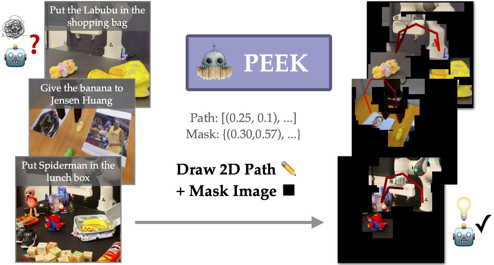

# TODOs

- [x] Add point tracking 
- [x] Add lerobot
- [x] Add openpi
- [ ] VLM bridge labeling code example
- [ ] Instructions for generating lerobot dataset from VLM labeled stuff
- [x] Add dataset link
- [x] Add model link
- [x] Add 3dda code 
- [x] Add gradio example
- [x] Add peek_vlm repo
- [ ] Add VLM training code

# PEEK: Guiding and Minimal Image Representations for Zero-Shot Generalization of Robot Manipulation Policies



<p align="center">
  <a href="https://arxiv.org/abs/2509.18282">
    
  </a>
  <a href="https://peek-robot.github.io/">
    
  </a>
  <a href="https://huggingface.co/datasets/memmelma/peek_vqa">
    
  </a>
  <a href="https://huggingface.co/memmelma/peek_3b">
    
  </a>
</p>

**PEEK** enhances the zero-shot generalization ability of any RGB-input manipulation policy by showing policies *where to focus on* and *what to do*. This guidance is given to the policy via a VLM that predicts *paths* and *masking points* to draw onto the policy's input images in closed-loop.

## 🚀 Quick Start

We include PEEK VLM inference, VLM data labeling, ACT+PEEK pre-trained models + inference (on widowx) + training code, Pi-0+PEEK pre-trained models + inference (on widowx) + training code, and 3D-DA simulation code.

### Installation 
```bash
git clone --recursive https://github.com/peek-robot/peek.git # to download all submodules

# or if you already downloaded the repo without --recursive:
git submodule update --init --recursive
```
- Follow the instructions in [peek_vlm](https://github.com/memmelma/peek_vlm/blob/main/README.md) to install the VLM.
- For ACT baseline training/inference, follow the instructions in [lerobot](https://github.com/peek-robot/lerobot/blob/main/README.md) to install the LeRobot.
- For Pi-0, follow the instructions in [openpi](https://github.com/peek-robot/openpi/blob/main/README.md) to install OpenPI.
- For data labeling, follow the instructions in [point_tracking](https://github.com/peek-robot/point_tracking/blob/main/README.md) to install the point tracking code.
- For 3D-DA simulation, follow the instructions in [3dda](https://github.com/peek-robot/threedda) to install the 3dda code.


### Basic Usage

## 📖 Overview

PEEK works by:

1. **VLM Fine-tuning**: Fine-tune a pre-trained VLM on automatically labeled robotics data to predict paths and masking points
2. **Policy Enhancement**: Use the VLM to guide any RGB-input policy during both training and inference
3. **Zero-shot Generalization**: Enable policies to generalize to new tasks, objects, and environments

### Key Features

- 🎯 **Path Prediction**: VLM predicts where the robot should move
- 🎭 **Masking Points**: VLM identifies relevant areas to focus on
- 🔄 **Closed-loop Guidance**: Real-time VLM predictions during policy execution
- 🧩 **Policy Agnostic**: Works with any RGB-input manipulation policy
- 🌍 **Zero-shot Generalization**: Tested on 535 real-world evaluations across 17 task variations

## 🏗️ Repository Structure

```
peek/
├── lerobot/                    # LeRobot (for ACT)
├── openpi/                    # OpenPI  (for Openpi)
├── 3dda/                      # For 3D-DA simulation code
├── point_tracking/            # Data Labeling code
└── peek_vlm/                  # PEEK-VLM wrapper
```

## 📊 Results

PEEK significantly improves policy performance across various scenarios:

- **Semantic Generalization**: Handles novel objects and instructions
- **Visual Clutter**: Robust performance in cluttered environments

## Data Annotation / Data Labeling

We use the point tracking code to label the data. 
To download raw OXE or BRIDGE_v2 datasets like we used for PEEK VLM training, or to try out the data annotation pipeline on your own dataset,
see the [point tracking](https://github.com/peek-robot/point_tracking/blob/main/README.md) for instructions and examples.

## Using PEEK's VLM to label data

We provide an example of using PEEK's VLM to label data in the [peek_vlm](https://github.com/memmelma/peek_vlm/blob/main/README.md) folder.

We have inference examples (gradio, server/client), and we also have an example of batched labeling of VLM outputs at [bridge example](https://github.com/memmelma/peek_vlm/blob/main/scripts/label_bridge_data.py) with instructions in the README.

Alternatively, if you just need the PEEK VLM path/mask labels for BRIDGE_v2, download [here](https://huggingface.co/datasets/jesbu1/peek_bridge_labels).

## Making a dataset with PEEK VLM labels

TODO

## Policy Training 

TODO

## Policy Inference

TODO

## 📄 Citation

```bibtex
@inproceedings{zhang2025peek,
    title={PEEK: Guiding and Minimal Image Representations for Zero-Shot Generalization of Robot Manipulation Policies}, 
    author={Jesse Zhang and Marius Memmel and Kevin Kim and Dieter Fox and Jesse Thomason and Fabio Ramos and Erdem Bıyık and Abhishek Gupta and Anqi Li},
    booktitle={arXiv:2509.18282},
    year={2025},
}
```


## 🙏 Acknowledgments

- Built on top of [VILA-1.5](https://github.com/Efficient-Large-Model/VILA)

## 🔗 Links

- [Project Website](https://peek-robot.github.io/)
- [Paper](https://arxiv.org/abs/TODO)
